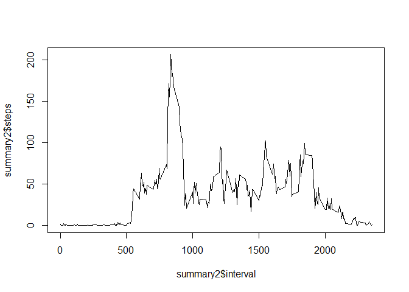

# Reproducible Research: Peer Assessment 1
This assignment makes use of data from a personal activity monitoring device. This device collects data at 5 minute intervals through out the day. The data consists of two months of data from an anonymous individual collected during the months of October and November, 2012 and include the number of steps taken in 5 minute intervals each day.

## Loading and preprocessing the data

```r
setwd("d:/github/RepData_PeerAssessment1")
library(dplyr)
```

```
## 
## Attaching package: 'dplyr'
## 
## The following object is masked from 'package:stats':
## 
##     filter
## 
## The following objects are masked from 'package:base':
## 
##     intersect, setdiff, setequal, union
```

```r
data<-read.csv("activity.csv")
```
The variables included in this dataset are: 
- steps: Number of steps taking in a 5-minute interval (missing values are coded as NA) 
- date: The date on which the measurement was taken in YYYY-MM-DD format 
- interval: Identifier for the 5-minute interval in which measurement was taken 
The dataset is stored in a comma-separated-value (CSV) file and there are a total of 17,568 observations in this dataset. 
 
Transform the data by grouping it by date 

```r
order_data <- group_by(data,date)
```

## What is mean total number of steps taken per day?
Summarizing the data by getting the sum of steps by date and calculating the mean steps per day 

```r
summary<-summarize(order_data, steps=sum(steps))
mean_val <- mean(summary$steps,na.rm=TRUE)
mean_val
```

```
## [1] 10766.19
```
calculating the median steps per day 

```r
median_val <-median(summary$steps,na.rm=TRUE)
median_val
```

```
## [1] 10765
```
displaying as a histogram 

```r
hist(summary$steps)
```

 
## What is the average daily activity pattern?
A Plot of the 5-minute interval (x-axis) and the average number of steps taken, averaged across all days (y-axis) 

```r
summary2<-summarize(group_by(data,interval), steps=mean(steps,na.rm=TRUE))
plot(summary2$interval, summary2$steps, type = "l")
```

 
The 5-minute interval, on which the average across all the days in the dataset, contains the maximum number of steps 

```r
summary2[which.max(summary2$steps),]$interval
```

```
## [1] 835
```

## Imputing missing values
Note that there are a number of days/intervals where there are missing values (coded as NA). 
The presence of missing days may introduce bias into some calculations or summaries of the data. 
The total number of missing values in the dataset (i.e. the total number of rows with NAs) 

```r
sum(is.na(data$steps))
```

```
## [1] 2304
```

To impute the missing values requires determining the mean steps per day and substituting the missing values with the mean. 
In my head I know what to do but ran out of time in trying to actually do it!! 


## Are there differences in activity patterns between weekdays and weekends?
I didnt get to this part. 


